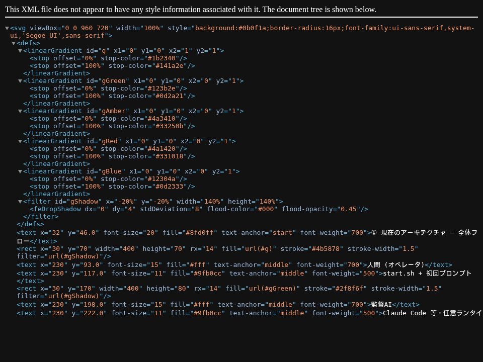
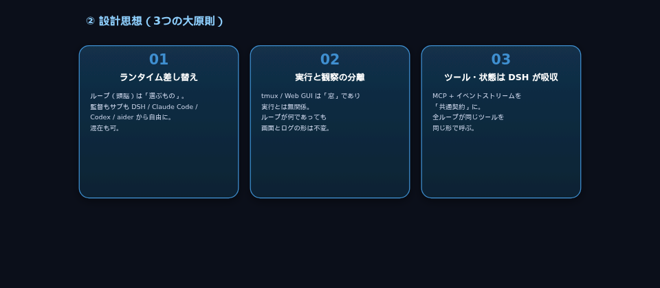
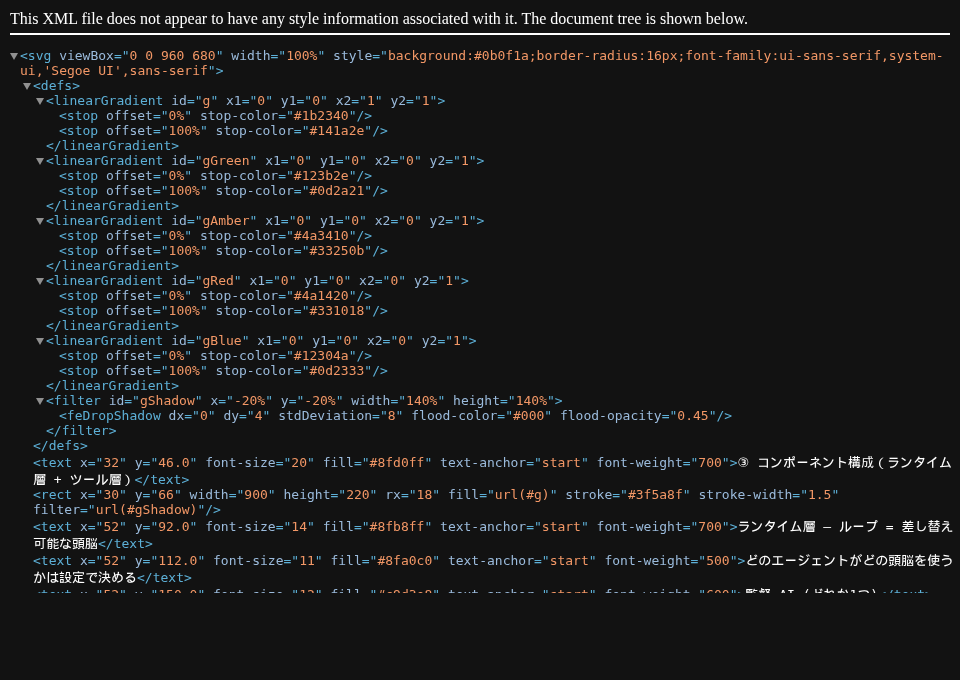
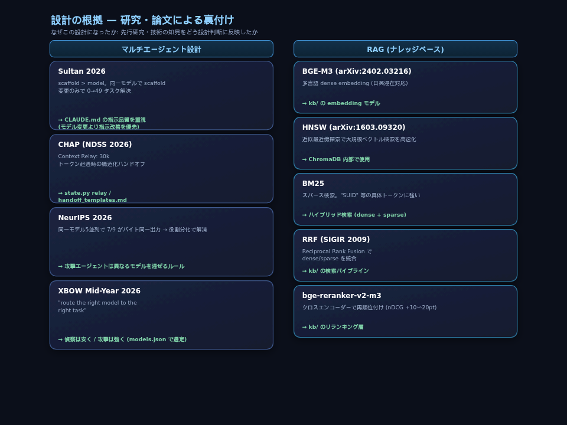

# moro-agent — AI マルチエージェント・バグバウンティ/VDP 基盤

監督 AI（オーケストレータ）が、差し替え可能なランタイム（Claude Code / Codex / aider / DSH）
のサブエージェントを並列起動し、共有状態を通して協調させて脆弱性を発見・報告する。

## アーキテクチャ



> 図の生成: `python3 docs/gen_design.py --svg-dir docs`（SVG 単体 + PNG + `DESIGN.html` を再生成。chromium があれば PNG も自動生成）

```
人間 ──start.sh──▶ 監督AI (Claude Code / 任意のランタイム)
                     │  run.sh でサブエージェント並列起動
        ┌────────────┼────────────┐
        ▼            ▼            ▼
    Claude Code    Codex(Fugu)   DSH       ← ランタイムレジストリ (差し替え可)
        └────────────┼────────────┘
                     ▼ 共通契約 (MCP + events.jsonl)
        ┌──────────────────────────────┐
        │  state/ (共有状態) + kb/ (RAG) │  ← 単一の真実源
        └──────────────────────────────┘
```

### 設計思想



### コンポーネント構成



## ディレクトリ構造

```
moro-agent/
├── README.md, CLAUDE.md / CLAUDE-bb.md   # 監督AIへの指示 (bb=バグバウンティモード)
├── handoff_templates.md                  # ハンドオフ/リレープロトコル (CHAP 準拠)
├── config                                # LAYOUT / TMUX_SESSION / MAX_AGENTS / EFFORT
├── models.json                           # モデル → ランタイムのマッピング
├── .env.example / .gitignore
│
├── scripts/                              # ★ コア (オーケストレーション)
│   ├── run.sh / start.sh                 #   監督・サブエージェント起動 (tmux)
│   ├── runner.py                         #   ランタイムレジストリ (モデル→起動コマンド解決)
│   ├── state.py                          #   共有状態管理 (host/tried/cred/finding/log/
│   │                                     #     spray/relay/resume/alert/event/reset)
│   ├── env_export.py                     #   models.json の env ブロック解決 (秘密は環境経由)
│   ├── wait_alert.sh                     #   監督のイベント駆動待機 (alert/イベントを約1秒で検知)
│   ├── check_updates.sh                  #   起動時更新チェック (skills submodule 等)
│   ├── sync_skills.py                    #   攻撃系スキルを .claude/skills/ へ公開
│   └── gen_report.py                     #   findings → Markdown レポート
│
├── kb/                                   #   ローカル RAG (BGE-M3 + BM25 + rerank)
├── mcp/                                  #   MCP サーバ (state.py/kb.py をツール公開)
├── tools/                                #   ペンテスト補助 (タスク単位のワンオフ)
│   ├── cors/                             #     CORS 解析 (analyzer/probe/mock/test)
│   ├── parse_scope.py                    #     program.html/csv → scope.json
│   ├── tokens.py                         #     トークン使用量の集計
│   └── verify_maps_key_browser.py        #     Google Maps キーの検証
├── docs/                                 #   設計ドキュメント (AS-IS/TO-BE 可視化 + 生成器)
├── data/                                 #   エンゲージメント入力 (program.csv/html 等)
│
├── state/                                #   共有状態 (全エージェントの接点) — ランタイム
│   ├── scope.json, hosts.json, creds.json, findings.json
│   ├── log.jsonl, events.jsonl           #   イベントストリーム (共通契約)
│   └── relay_*.json, alerts.json
├── logs/  workspace/  archive/           #   ランタイム (gitignore 済み)
└── mcp/.venv/                            #   MCP SDK 用の隔離環境 (gitignore 済み)
```

## 使い方

```bash
cp .env.example .env && vim .env        # API キー (サブスクなら不要)
vim state/scope.json                     # ターゲット・RoE
./scripts/start.sh                       # 監督AI 起動 (tmux 自動)
./scripts/start.sh --no-update-check     # 起動時の更新確認をスキップ
```

起動時に skills submodule（`third_party/Anthropic-Cybersecurity-Skills`）と
フレームワーク本体（`origin/main`）の更新を確認し、更新があれば適用するか
対話確認する（ネットワーク不可・更新なしの場合は無言で続行）。

監督AIへの最初のプロンプト:
```
CLAUDE.md, handoff_templates.md, models.json, config, state/scope.json を読んで、
監督者として攻撃計画を立て、run.sh でサブエージェントを起動してください。
```

サブエージェント起動（監督AI が実行）:
```bash
./scripts/run.sh glm-5.3 "ドメインの API エンドポイントを調査して"        # モデル名で
./scripts/run.sh wave1 claude-haiku-4-5 "偵察して"                          # 明示ID + モデル
```

観察（実行とは分離された「窓」）:
```bash
./scripts/run.sh --tail [AGENT_ID]      # エージェントのログを tail -f
./scripts/run.sh --events               # 構造化イベントストリームを follow
./scripts/run.sh --monitor              # state 概要を watch
```

## 設計思想

- **CLAUDE.md が全て** — 人間 → 監督 → サブの指示系統をプロンプトで定義
- **state/ が唯一の接点** — エージェント間通信は JSON 経由。tried 配列で重複排除
- **ランタイム差し替え** — `scripts/runner.py` のレジストリでモデル→ランタイムを解決。
  Claude Code / Codex / aider を差し替え、新ランタイム (dsh 等) は 1 エントリ追加で拡張
- **dsh ランタイム** — `dsh --profile headless "タスク"` で DeepSeek Harness 自身を
  ワンショットのサブエージェントとして起動 (プロンプトは argv で渡す)。モデル・認証は
  DSH 設定 ($DSH_HOME) に従う。models.json の `dsh-default` が対応。
- **共通契約** — `events.jsonl`(構造化イベント) + MCP(`mcp/server.py`) で
  どのランタイムからも同じツール・状態を同じ形で呼べる
- **実行と観察の分離** — tmux は観察窓 (`--tail`/`--events`)。ログ・イベントが真実の源
- **イベント駆動の監督待機** — `wait_alert.sh` が alerts/events の変化を約1秒で検知。
  relay → 次エージェント起動までのダウンタイムを実質ゼロに (旧: 最大5分の定期確認)
- **Context Relay は2段しきい値 (CHAP)** — ソフト 30k (チェックポイントで relay・品質優先) /
  ハード 60k (即 relay・劣化蓄積の保険)。auto-compact の要約損失より構造化 relay を優先

## セキュリティ

- API キーは argv でなく**環境変数経由で継承**（`ps` への平文露出を防止）
- 共有状態は `state.py` の `locked_json` で read-modify-write を flock（並行時の欠落・ID重複を防止）
- RoE/VDP ルール（1 req/sec, DoS禁止, PII即停止等）は CLAUDE.md と scope.json で規定

## ランタイムレジストリ

`models.json` にモデル名を追加し、`scripts/runner.py` の `RUNTIMES` にエントリを足すだけで
新ランタイムを追加できる。

| モデル例 | runtime | ループ | モデル/認証 | prompt 渡し |
|---|---|---|---|---|
| claude-*, glm-* | `claude-code` | Anthropic 製 | models.json + .env | tui (tmuxペースト) |
| fugu-ultra | `codex` | OpenAI 製 | Sakana API (api.sakana.ai) | tui |
| dsh-default | `dsh` | DSH 製 (`dsh-agent-loop`) | DSH 設定 ($DSH_HOME) | argv (コマンド埋込) |
| (任意) | `aider` | Aider 製 | models.json | tui |

## MCP ツール (共通契約)

`mcp/server.py` が `state.py` / `kb.py` を MCP ツールとして公開。Claude Code と Codex の
両方から同じツール面を自然言語で利用できる（`start.sh` が `mcp_setup.sh` で自動登録）。

| 分類 | ツール |
|---|---|
| 検索 | `kb_query` |
| 状態 | `state_show` / `state_host` / `state_tried` / `state_cred` / `state_finding` |
| 記録 | `state_log` / `state_alert` / `state_event` |
| 連携 | `state_spray` / `state_relay` / `state_resume` |

**実地確認済み**: Claude Code / Codex の両方で `kb_query`（KB検索）、`state_finding`、
`state_alert`、`state_show` が「自然言語 → ツール発火 → 副作用」を確認。残りも MCP
プロトコルレベルで全ツール動作確認済み。

## テスト

```bash
python3 -m pytest          # tools/ (CORS 分析 16 テスト)
```

## 設計の根拠（研究・論文）

「なぜこの設計か」は、先行研究・技術の知見を土台にしている。以下は主要な裏付けと、
それぞれをどう設計判断に反映したかの対応表。



### マルチエージェント設計

| 論文 / プロジェクト | 知見 | フレームワークへの反映 |
|---|---|---|
| **Sultan 2026** | scaffold > model。同一モデルで scaffold を変えただけで 0 → 49 タスク解決 | `CLAUDE.md` の指示品質を重視。モデル変更より指示改善を優先 |
| **CHAP (NDSS 2026)** | Context Relay — 30k トークン超過時の構造化ハンドオフ | `state.py relay` / `handoff_templates.md` の設計 |
| **NeurIPS 2026** | 同一モデル 5 並列 → 7/9 クエリがバイト同一出力 → 役割分化で解消 | モデル多様性ルール（攻撃エージェントは異なるモデルを混ぜる） |
| **XBOW Mid-Year 2026** | "route the right model to the right task" が結論 | 偵察は安く / 攻撃は強く。`models.json` でモデル選定を構造化 |

### RAG（ナレッジベース）

| 論文 / 技術 | 内容 | フレームワークへの反映 |
|---|---|---|
| **BGE-M3** (arXiv:2402.03216) | 多言語 dense embedding。日英混在対応 | `kb/` の embedding モデル |
| **HNSW** (arXiv:1603.09320) | 近似最近傍探索。大規模ベクトル検索を高速化 | ChromaDB 内部で使用 |
| **BM25** | スパースキーワード検索。"SUID" 等の具体的トークンに強い | `kb/` のハイブリッド検索（dense + sparse） |
| **RRF** (SIGIR 2009) | Reciprocal Rank Fusion。dense と sparse の検索結果を統合 | `kb/` の検索パイプライン |
| **bge-reranker-v2-m3** | クロスエンコーダーによるリランキング。nDCG を 10–20pt 改善 | `kb/` のリランキング層 |

## セキュリティスキルライブラリ（攻撃系サブドメインを自動公開）

攻撃手順・エクスプロイト技法のスキルを、外部の大規模ライブラリから**攻撃系 257 個**に
絞って `.claude/skills/` へ公開する。Claude Code が description で自動ディスカバリし、
状況に応じて手順を読み込む（description のみ常時・本文は発動時）。

```bash
python3 scripts/sync_skills.py            # 攻撃系 257 個を symlink で公開
python3 scripts/sync_skills.py --all      # 全 817 個を公開
git submodule update --init --recursive   # 初回は submodule 取得が必要
```

- **引用元**: [mukul975/Anthropic-Cybersecurity-Skills](https://github.com/mukul975/Anthropic-Cybersecurity-Skills)
  （Apache-2.0 / 817 skills / Claude Code 互換 SKILL.md 形式）
- **絞り込み**: red-teaming / penetration-testing / web-application / api /
  malware-analysis（RE 含む）/ network-security / identity-access 等の
  攻撃系サブドメインのみ（`scripts/sync_skills.py` の `ATTACK_SUBDOMAINS` で調整可）
- **コンテキスト**: description 総量は攻撃系で約 7,093 token（200k の約 3.5%）。
  全 817 だと約 27,893 token で、うち防御系（threat-hunting / SOC / forensics 等）が
  用途外ノイズとなるため絞り込んでいる

> ⚠️ 本ライブラリはコミュニティプロジェクト（Anthropic 非公式）。攻撃・デュアルユース
> 技法を含むため、認可されたスコープ内でのみ使用すること。
